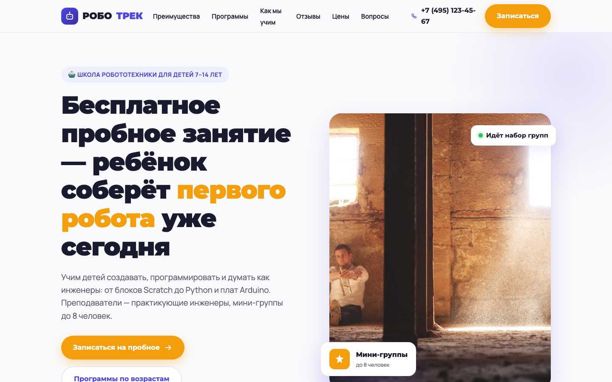
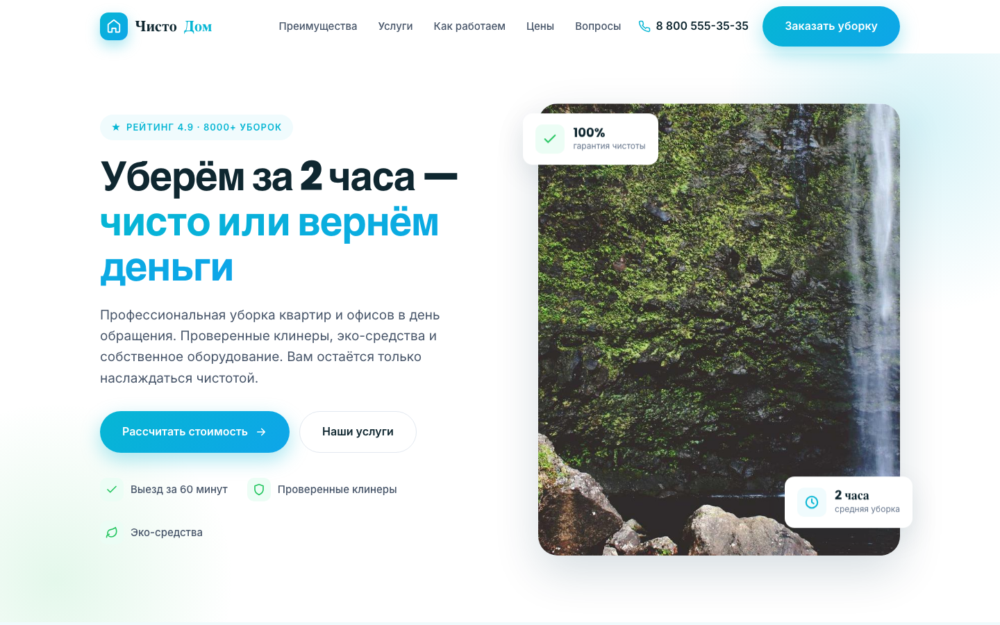
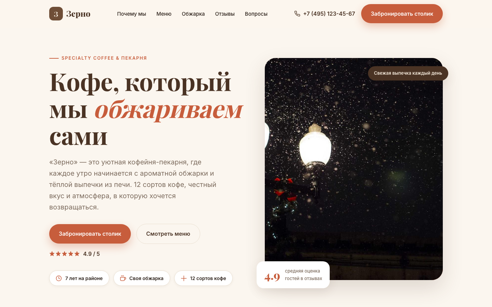
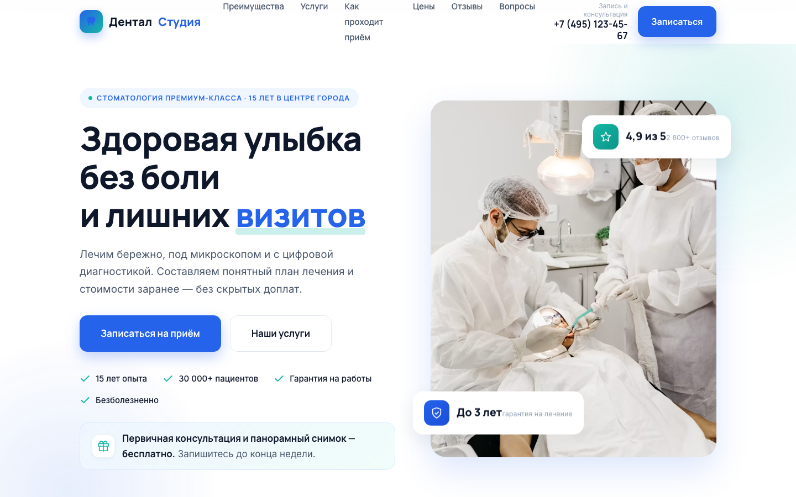
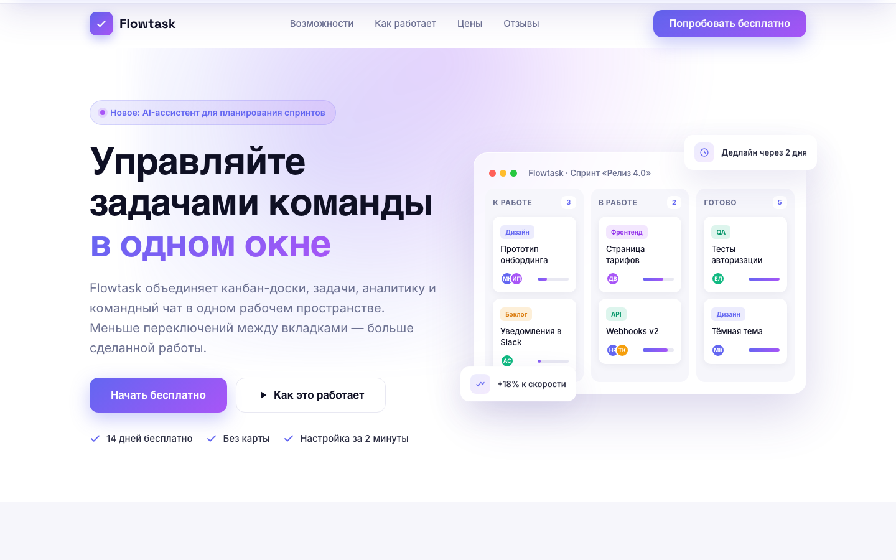
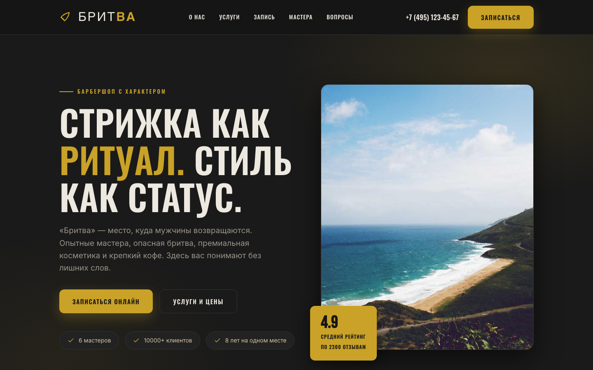
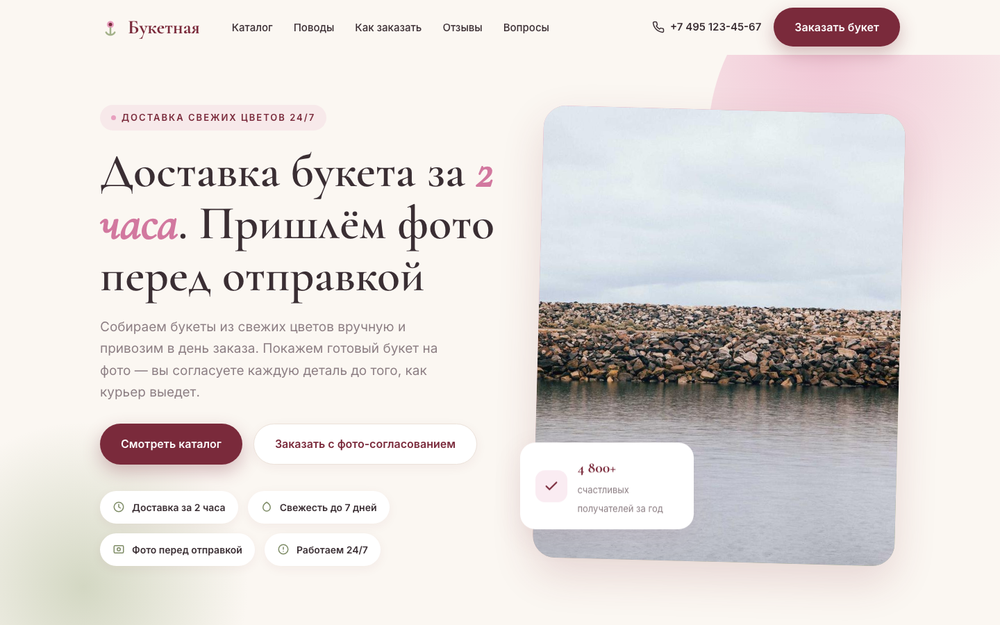
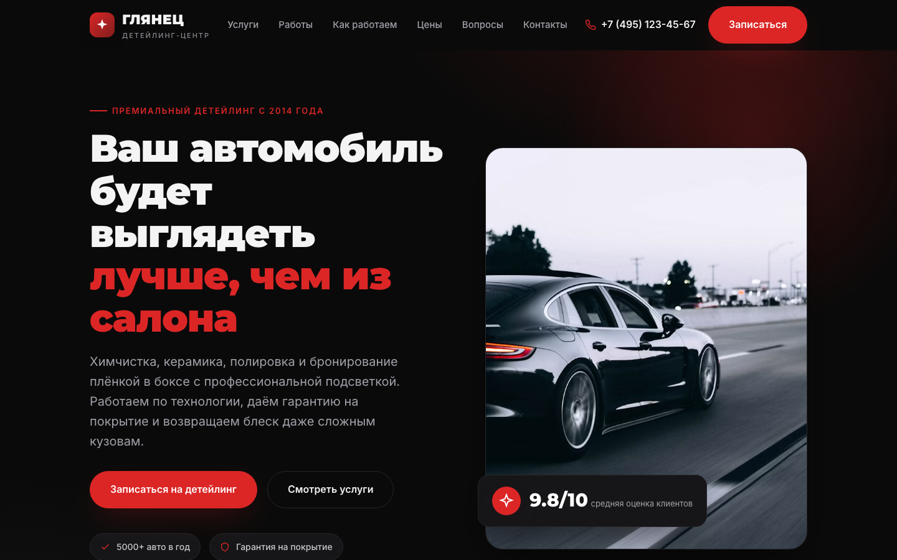
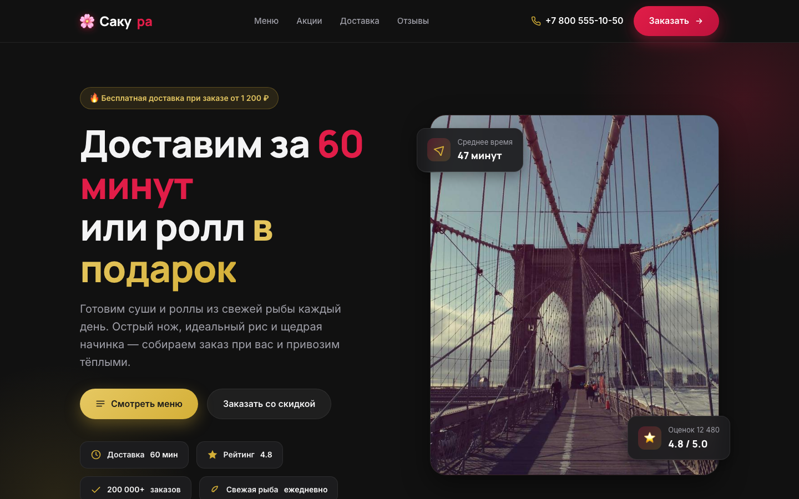
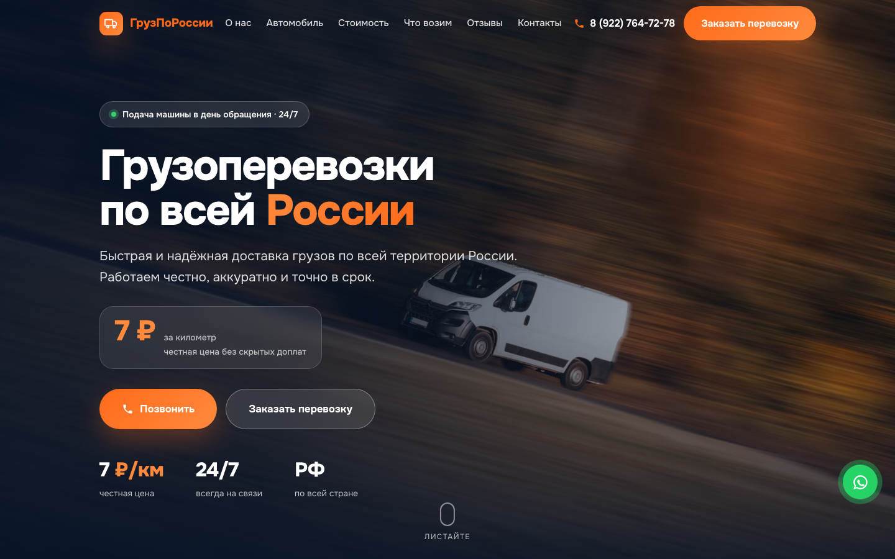

# 💼 Портфолио — лендинги (веб-дизайн и вёрстка)

11 одностраничных сайтов под разные ниши. Чистый HTML/CSS/JS, без фреймворков, полностью адаптивные.

👉 **Главная страница-галерея:** [`index.html`](index.html)

---

## 🖼️ Работы

| Превью | Проект | Ниша |
|---|---|---|
|  | **РОБОТРЕК** — [открыть](landings/01-robotrek.html) | Школа робототехники для детей |
|  | **ЧистоДом** — [открыть](landings/02-chistodom.html) | Клининг |
|  | **Зерно** — [открыть](landings/03-zerno.html) | Кофейня-пекарня |
|  | **Пульс** — [открыть](landings/04-puls.html) | Фитнес / EMS-студия |
|  | **Дентал Студия** — [открыть](landings/05-dental.html) | Стоматология |
|  | **Flowtask** — [открыть](landings/06-flowtask.html) | SaaS таск-менеджер |
|  | **Бритва** — [открыть](landings/07-britva.html) | Барбершоп |
|  | **Букетная** — [открыть](landings/08-buketnaya.html) | Доставка цветов |
|  | **Глянец** — [открыть](landings/09-glyanec.html) | Детейлинг авто |
|  | **Сакура** — [открыть](landings/10-sakura.html) | Доставка суши |
|  | **ГрузПоРоссии** — [открыть](landings/11-logistic/) | Грузоперевозки по России |

---

## 📁 Структура

```
фриланс/
├── index.html              ← галерея портфолио
├── landings/               ← 11 лендингов (10 одиночных HTML + 11-logistic/ — отдельный проект)
├── screenshots/            ← скриншоты: *-cover / *-desktop / *-mobile
├── ТЗ — лендинг РОБОТРЕК.md ← пример технического задания
└── Тексты для откликов и профиля.md ← заготовки для бирж
```

## ⚙️ Что внутри каждого лендинга
- Адаптив: десктоп / планшет / мобильный (брейкпоинты 1024 / 768 / 480 px)
- Форма заявки с JS-валидацией, маской телефона и согласием на обработку ПДн (персональные данные)
- FAQ-аккордеон, плавный скролл, sticky-шапка с бургер-меню, кнопка «наверх»
- SEO (поисковая оптимизация): title, description, Open Graph, favicon
- Без внешних библиотек (только Google Fonts), картинки — picsum.photos с градиентными фолбэками

---

## 🚀 Как опубликовать в интернете (GitHub Pages, бесплатно)

> Нужен аккаунт на [github.com](https://github.com). Команды выполнять в этой папке.

1. **Создайте репозиторий** на GitHub (кнопка «New»), например с именем `portfolio`. Не добавляйте README при создании.
2. В терминале (вы уже в папке `фриланс`, git-репозиторий инициализирован):
   ```bash
   git remote add origin https://github.com/ВАШ_ЛОГИН/portfolio.git
   git branch -M main
   git push -u origin main
   ```
3. На GitHub: **Settings → Pages → Source → Deploy from a branch → ветка `main`, папка `/ (root)` → Save**.
4. Через 1–2 минуты сайт будет доступен по адресу:
   `https://ВАШ_ЛОГИН.github.io/portfolio/`

Эту ссылку можно вставлять в отклики на YouDo (Ю-Ду) и Kwork (Кворк) — клиенту откроется живая галерея.

---

*Все проекты — концептуальные (демонстрационные) работы для портфолио.*
